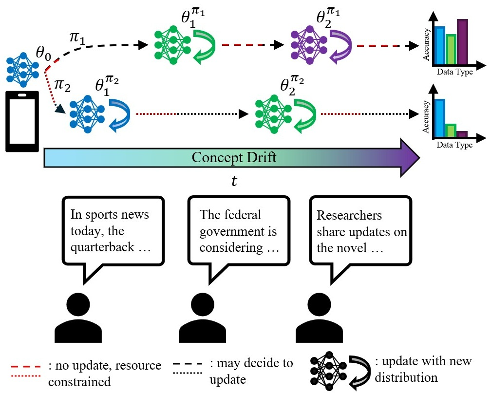

# RCCDA: Adaptive Model Updates in the Presence of Concept Drift under a Constrained Resource Budget  
**NeurIPS 2025**  

[[`arXiv`](https://arxiv.org/abs/2505.24149)] [[`PDF`](paper/2505.24149.pdf)]  

Official code for **Resource-Constrained Concept Drift Adaptation (RCCDA)** — a lightweight, theoretically-grounded policy that optimally decides when to update a deployed model under strict average resource constraints while adapting to concept drift.



> **Paper highlight**: RCCDA uses only past inference loss and a virtual queue to achieve provably bounded resource usage while greedily minimizing a convergence upper bound derived from Lyapunov drift-plus-penalty — no drift detector required.

### Key Features
- No explicit drift detection -> zero overhead from ADWIN, DDM, etc.
- Strict theoretical guarantee on average update cost ≤ $\bar{\lambda}$
- Greedy-optimal per-step decisions via Lyapunov framework
- Simple threshold-based policy (Algorithm 1 in the paper)
- Easy to compute loss-based estimator $\hat{G}$

### Quick Start

```bash
# Clone the repo
git clone https://github.com/Adampi210/RCCDA_resource_constrained_concept_drift_adaptation_code.git
cd RCCDA_resource_constrained_concept_drift_adaptation_code

# Create environment
conda env create -f environment.yml   # or: pip install -r requirements.txt
conda activate rccda

# Install the package
pip install -e .

# Run PACS experiment with gradual drift and budget ¯λ = 0.1
python experiments/train_rccda.py \
    dataset=pacs \
    drift.type=gradual \
    policy.budget=0.1 \
    policy.V=1000 \
    seed=42